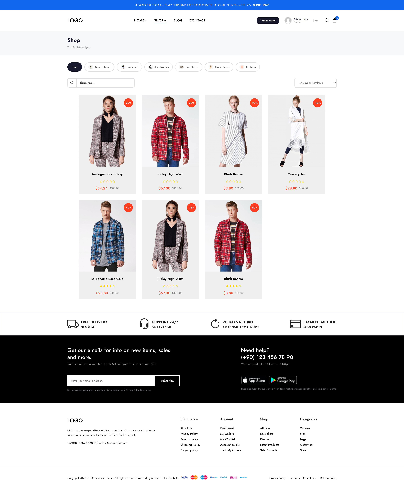
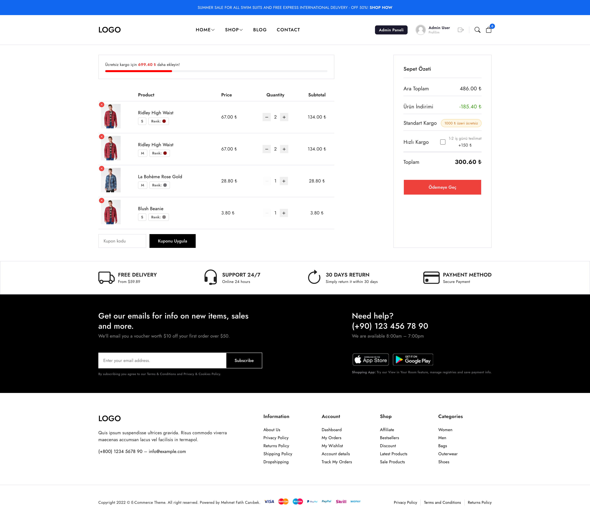
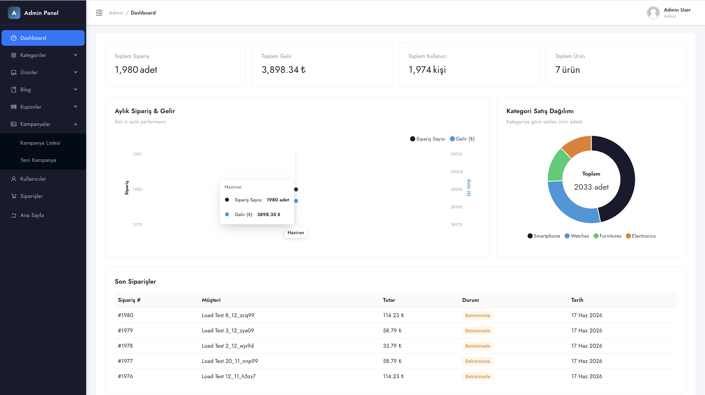
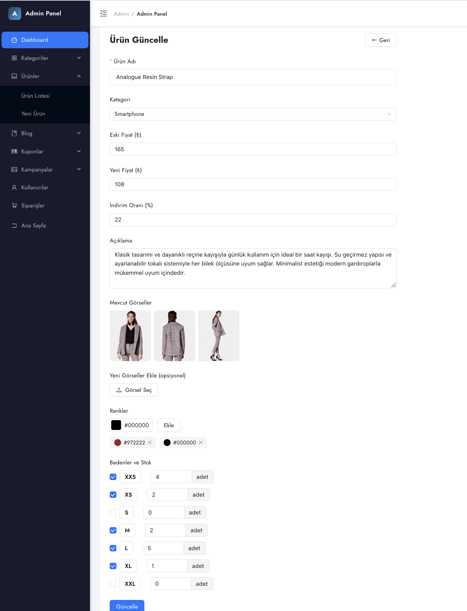
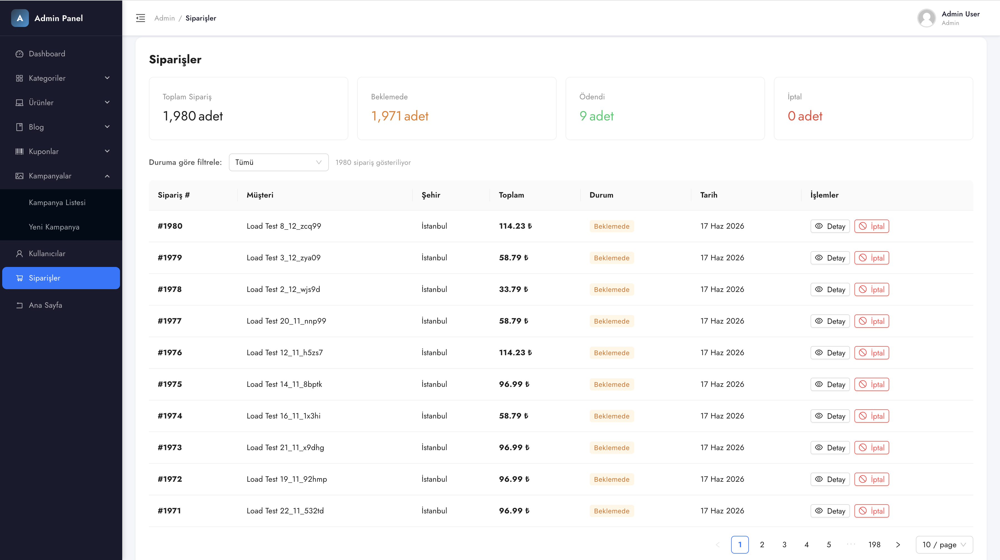
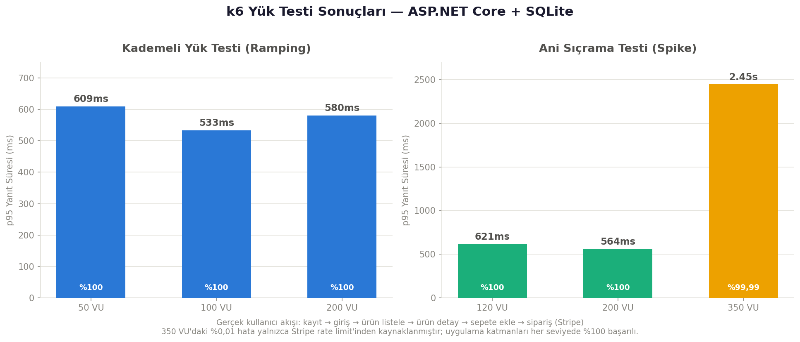

# 🛍️ E-Commerce Platform

Tam kapsamlı, üretime hazır bir e-ticaret platformu. **ASP.NET Core Web API** (backend) ve **React + TypeScript** (frontend) ile geliştirilmiş; kimlik doğrulama, ödeme entegrasyonu, admin paneli, yorum sistemi ve gerçek kullanıcı senaryolu yük testlerini içerir.

🔗 **Canlı Demo:** [e-commerce-3zjr.onrender.com](https://e-commerce-3zjr.onrender.com)

> ⏳ Ücretsiz barındırma kullanıldığı için site uzun süre ziyaret edilmediğinde uyku moduna geçer; ilk açılış 30-50 saniye sürebilir.

---


---

## 📋 İçindekiler

- [Özellikler](#-özellikler)
- [Teknoloji Yığını](#-teknoloji-yığını)
- [Güvenlik](#-güvenlik)
- [Ekran Görüntüleri](#-ekran-görüntüleri)
- [Yük Testi](#-yük-testi-load-testing)
- [Kurulum](#-kurulum)
- [Demo Hesapları](#-demo-hesapları)

---

## ✨ Özellikler

### 🛒 Müşteri Tarafı
- **Ürün vitrini** — slider, kategoriler, öne çıkan ürünler, kampanyalar, blog
- **Ürün listeleme ve detay** — çoklu görsel galerisi, renk ve beden seçimi
- **Beden bazlı stok kontrolü** — her beden için ayrı stok takibi; stoğu biten beden seçilemez
- **Sepet yönetimi** — adet artırma/azaltma, stok aşımı engeli, kupon uygulama
- **Ödeme** — Stripe ödeme entegrasyonu
- **Sipariş takibi** — kullanıcı kendi panelinden siparişlerinin durumunu takip eder
- **Yorum ve puanlama** — herkes ürünlere yorum yapıp puan verebilir; kullanıcı kendi yorumunu düzenleyip silebilir
- **Profil yönetimi** — bilgi güncelleme, avatar yükleme

### 🛠️ Admin Paneli
Tam CRUD (ekleme / güncelleme / silme) yönetimi:
- **Ürün yönetimi** — görsel, renk, beden ve stok yönetimi
- **Kategori yönetimi**
- **Kupon yönetimi**
- **Kampanya yönetimi**
- **Blog yönetimi** — zengin metin editörü (TipTap)
- **Sipariş yönetimi** — tüm kullanıcıların siparişlerini görüntüleme ve durum güncelleme
- **Kullanıcı yönetimi** — rol atama, kullanıcı silme (aşağıdaki güvenlik kurallarıyla)
- **Yorum müdahalesi** — admin tüm kullanıcıların yorumlarını düzenleyebilir/silebilir
- **Dashboard** — istatistikler ve grafikler

### 📱 Responsive Tasarım
Arayüz tamamen mobil uyumludur; masaüstü, tablet ve telefon ekranlarına duyarlı (responsive) olarak tasarlanmıştır.

---

## 🧰 Teknoloji Yığını

### Frontend
- **React** + **TypeScript**
- **Redux Toolkit** — durum yönetimi
- **React Router** — yönlendirme
- **Ant Design** — UI bileşenleri
- **Axios** — HTTP istemcisi

### Backend
- **ASP.NET Core Web API**
- **Entity Framework Core** — ORM
- **ASP.NET Core Identity** — kullanıcı ve rol yönetimi
- **JWT** — kimlik doğrulama (token, HttpOnly cookie içinde)
- **SQLite** — veritabanı
- **Stripe** — ödeme altyapısı

### DevOps & Test
- **Docker** — konteynerleştirme
- **Render** — barındırma (canlı deploy)
- **k6** — yük testi (load testing)

---

## 🔒 Güvenlik

Bu proje, gerçek dünya güvenlik pratikleri göz önünde bulundurularak geliştirilmiştir:

### JWT'nin Cookie'de Saklanması (XSS Koruması)
JWT token'ı `localStorage` yerine **HttpOnly cookie** içinde saklanır. Bunun nedeni, `localStorage`'ın JavaScript ile erişilebilir olması ve **XSS (Cross-Site Scripting)** saldırılarına açık olmasıdır. HttpOnly cookie'ye JavaScript erişemez, bu da token hırsızlığı riskini azaltır.

### Admin Yetkilendirme Kuralları
Kullanıcı rollerinin yönetiminde ekstra güvenlik katmanları uygulanmıştır:
- **Şifre doğrulaması zorunlu** — Bir kullanıcıyı admin yapmak veya bir adminin yetkisini kaldırmak için, işlemi yapan **adminin kendi şifresini girmesi gerekir**. Şifre olmadan rol değişikliği yapılamaz.
- **Son admin korunur** — Sistemdeki son admin kullanıcısının yetkisi kaldırılamaz veya hesabı silinemez (sistem adminsiz kalamaz).
- **Kendini silme engeli** — Admin kendi hesabını silemez.

### Diğer Güvenlik Önlemleri
- **Beden bazlı stok kontrolü** — Sepete ekleme ve sipariş anında, ilgili bedenin stok sınırı sunucu tarafında doğrulanır; stok aşımı engellenir.
- **Yetki bazlı yorum yönetimi** — Kullanıcılar yalnızca kendi yorumlarını düzenleyip silebilir; admin tümüne müdahale edebilir. Yetki kontrolü sunucu tarafında yapılır.
- **Dosya yükleme doğrulaması** — Yüklenen görsellerde tip (jpg/png/webp/gif) ve boyut (maks. 5 MB) kontrolü.
- **Ödeme callback koruması** — Aynı ödeme bildiriminin iki kez işlenip stoğu mükerrer düşürmesi engellenir.
- **Production hata yönetimi** — Canlı ortamda hata detayları (stack trace) dışarıya sızdırılmaz.

---

## 📸 Ekran Görüntüleri

### Ana Sayfa


### Ürünler


### Sepet


### Admin Dashboard


### Admin Ürün Detay


### Admin Siparişler


---

## 🔬 Yük Testi (Load Testing)

Proje canlıya alınmadan önce [k6](https://k6.io) ile iki farklı senaryoda test edilmiştir. Gerçek kullanıcı akışı simüle edilmiştir: **kayıt → giriş → ürün listeleme → ürün detayı → sepete ekleme → sipariş oluşturma (Stripe ödeme oturumu dahil).**



### Kademeli Yük Testi (Ramping)
Kullanıcı sayısının zamanla kademeli arttığı, normal trafiği simüle eden senaryo.

| Eşzamanlı Kullanıcı | İstek/sn | Toplam İstek | p95 Yanıt | Başarı |
|--------------------:|---------:|-------------:|----------:|-------:|
| 50 VU  | ~50  | 4.344  | 609ms | %100 |
| 100 VU | ~99  | 12.186 | 533ms | %100 |
| 200 VU | ~99  | 24.342 | 580ms | %100 |

### Ani Sıçrama Testi (Spike)
Kısa sürede ani kullanıcı artışını (flash-sale / kampanya) simüle eden senaryo.

| Eşzamanlı Kullanıcı | İstek/sn | Toplam İstek | p95 Yanıt | Başarı |
|--------------------:|---------:|-------------:|----------:|-------:|
| 120 VU | —    | 7.440  | 621ms | %100 |
| 200 VU | ~121 | 12.276 | 564ms | %100 |
| 350 VU | ~117 | 25.380 | 2.45s | %99,99 |

### Önemli Not
350 eşzamanlı kullanıcı testinde gözlemlenen az sayıdaki hata (%0,01), uygulamanın kendi kodundan **değil**, üçüncü taraf ödeme sağlayıcısı **Stripe'ın rate limit'inden** kaynaklanmaktadır. Stripe test ortamı saniyede sınırlı sayıda istek kabul eder; yüksek eşzamanlılıkta çok sayıda checkout oturumu açıldığında bu sınır tetiklenir.

Uygulamanın kendi katmanları — kimlik doğrulama, ürün listeleme, sepet yönetimi, sipariş kaydı — **her yük seviyesinde %100 başarı** ile çalışmıştır. Gerçek bir üretim ortamında bu durum, ödeme isteklerinin kuyruğa alınması (queue) veya yeniden deneme (retry) mekanizmasıyla yönetilir.

---

## 🚀 Kurulum

### Gereksinimler
- [.NET 9 SDK](https://dotnet.microsoft.com/download)
- [Node.js](https://nodejs.org/) (18+)

### Backend

```bash
cd API

# appsettings.example.json'ı kopyalayıp kendi değerlerinizi girin
cp appsettings.example.json appsettings.Development.json

# Veritabanını oluştur (migration + seed otomatik çalışır)
dotnet ef database update

# Çalıştır
dotnet run
```

Backend `http://localhost:5115` adresinde çalışır.

### Frontend

```bash
cd Client

# Bağımlılıkları yükle
npm install

# Geliştirme sunucusunu başlat
npm run dev
```

Frontend `http://localhost:5175` adresinde çalışır.

### Yapılandırma
`appsettings.Development.json` içinde aşağıdaki değerleri kendi anahtarlarınızla doldurun:
- `Stripe:SecretKey` ve `Stripe:PublishableKey` — [Stripe](https://stripe.com) test anahtarları
- `AppSettings:Secret` — JWT imzalama anahtarı (en az 32 karakter)
- `EmailSettings` — SMTP ayarları (iletişim formu için)

> ⚠️ `appsettings.Development.json` dosyası `.gitignore`'dadır; hassas anahtarlar versiyon kontrolüne dahil edilmez.

---

## 👤 Demo Hesapları

| Rol | E-posta | Şifre |
|-----|---------|-------|
| **Admin** | admin | admin@gmail.com | 123456 |
| **Müşteri** | customer | customer@gmail.com | 123456 |

> Ödeme testleri için Stripe test kartı: `4242 4242 4242 4242` — tarih: `12/34` ve CVC: `123` ile.

---

## 📝 Lisans

Bu proje kişisel portföy amaçlı geliştirilmiştir.

---

## 🙏 Teşekkür & İlham

Bu projenin frontend (React) kısmı, Emin Başbayan hocanın Udemy'deki "MERN Stack ile Admin Panelli, Ödeme Yöntemli, Full-Stack E-Ticaret Sitesi Yapımı" adlı kursundan ilham alınarak geliştirilmiştir.

Yaklaşık 8 ay önce React bilgimi ileri taşımak amacıyla aldığım bu kursu tamamladıktan sonra ASP.NET Core alanına yöneldim ve bu alanda çeşitli projeler geliştirdim. Seviyemi bir adım öteye taşımak için proje fikri ararken, eğitimdeki projeyi temel alıp frontend tarafını kendi ihtiyaçlarıma göre geliştirip dönüştürdüm, backend tarafını ise ASP.NET Core ile tamamen sıfırdan kendim yazdım. Ortaya, yaklaşık 2 aylık bir çalışmanın sonucunda bu gerçek dünyaya uyumlu proje çıktı.

Emin hocaya, öğretici ve ilham verici eğitimi için emeğine teşekkür ederim. 🙏


**Geliştirici:** Mehmet Fatih Canıbek
🔗 [GitHub](https://github.com/M-Fatih00)